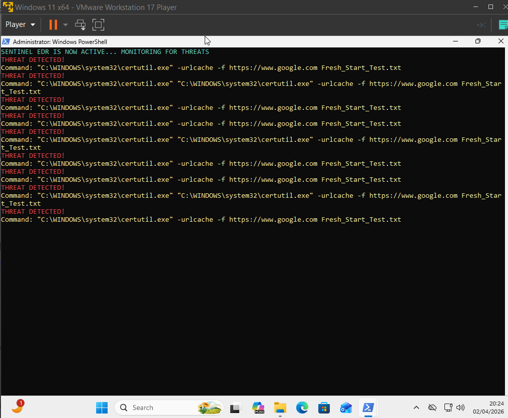

[README.md](https://github.com/user-attachments/files/26445500/README.md)
# Sentinel EDR — Custom Endpoint Detection with Wazuh SIEM Integration

> A hands-on cybersecurity project built to understand how real EDR tools work — from raw telemetry on a Windows endpoint all the way to a critical alert on a SIEM dashboard.

---

## Why I Built This

Standard antivirus tools often miss a specific class of attacks called **Living-off-the-Land (LotL)** — attacks where the attacker doesn't use custom malware, they just abuse Windows' own built-in tools like `certutil`, `vssadmin`, or `lsass`. No malware file = antivirus has nothing to scan.

I wanted to understand how security teams actually catch these. So I built a custom monitoring agent from scratch, wired it into a real SIEM (Wazuh), and designed rules that fire a **Level 12 Critical Alert** whenever those tools are misused.

This project taught me the full pipeline — from writing the detection script, to configuring the SIEM agent, to engineering the backend rules, to validating the logic when the UI doesn't cooperate.

---

## What It Does

A PowerShell script (`Sentinel_Monitor.ps1`) runs on a Windows VM and watches **Event ID 4688** (Process Creation) in real time. The moment it sees something suspicious — like `certutil` making a network call — it captures the event, structures it as JSON, and writes it to a log file.

A Wazuh Agent on the same machine tails that file and forwards the data over the network to a **Wazuh Manager running on Kali Linux**. On the Kali side, custom decoders parse the JSON and custom rules evaluate it. If the threat field hits "Critical", Rule `100001` fires a **Level 12 alert** mapped to **MITRE ATT&CK T1059** (Command and Scripting Interpreter).

---

## Architecture

```
[ Windows VM ]
     |
     |  PowerShell Script monitors Event ID 4688
     |  Suspicious process? → writes to Alerts.json
     |
[ Wazuh Agent (Windows) ]
     |
     |  Tails Alerts.json → encrypts → sends over Port 1514
     |
[ Wazuh Manager (Kali Linux) ]
     |
     |  Decoder parses JSON fields (Process, Command, Threat)
     |  Rule 100001 checks → if Threat = Critical → Level 12 Alert
     |
[ Wazuh Dashboard ]
     |
     └─ SOC-style visualization: graphs, tables, event timeline
```

**4 Layers:**

| Layer | Component | Job |
|---|---|---|
| Endpoint | `Sentinel_Monitor.ps1` | Detects suspicious processes, writes JSON |
| Bridge | Wazuh Agent (Windows) | Ships logs to manager over secure channel |
| Brain | Wazuh Manager (Kali) | Decodes + applies custom rules |
| Eyes | Wazuh Dashboard | Visual alerts for analyst review |

---

## Features

- Catches `lsass` dumping, `certutil` abuse, and `vssadmin` tampering
- Custom decoder that parses the exact JSON structure the script outputs
- Rule `100001` — Level 12 severity, built specifically for this threat class
- MITRE ATT&CK T1059 mapping baked into the rule definition
- Windows Security, System, and Application channels all configured for ingestion
- Logic validated via `wazuh-logtest` independent of dashboard availability

---

### 📸 Visual Proof of Work

#### 1. EDR Detection (PowerShell)

*Script catching certutil abuse in real-time.*

#### 2. Logic Validation (Wazuh Logtest)

*Rule 100001 triggering Level 12 alert on the manager.*

#### 3. SIEM Dashboard

*Active agent connectivity and event monitoring.*
---

## How to Run It

### Prerequisites

- Windows 10/11 VM with PowerShell 5.1+, run as Administrator
- Kali Linux VM with Wazuh Manager installed
- Wazuh Agent installed on the Windows VM, pointed at the Kali IP
- Both VMs on the same network (NAT or Host-Only adapter)

---

### Step 1 — Start the Wazuh Manager (Kali Linux)

```bash
sudo systemctl status wazuh-manager
# If not running:
sudo systemctl start wazuh-manager
```

Open the Wazuh Dashboard in your browser and log in (`admin` / `admin`).

---

### Step 2 — Verify Windows Agent is Connected

Open **Wazuh Agent Monitor** from the taskbar on Windows. Status should say **Running** and the Manager IP should be correct.

Check that the log folder exists:
```
C:\Sentinel-EDR\logs\
```
If not, create it manually. The script will create `Alerts.json` inside it when a threat is detected.

---

### Step 3 — Run the Detection Script

Open **PowerShell as Administrator** and navigate to the script:

```powershell
cd C:\Users\Yatendra\Desktop\Sentinel-EDR-Wazuh\src
.\Sentinel_Monitor.ps1
```

You'll see the banner:
```
SENTINEL EDR IS NOW ACTIVE — Monitoring for threats...
```

The script is now watching in real time.

---

### Step 4 — Simulate an Attack

Open a **second PowerShell window** (keep the first one running) and run:

```powershell
certutil -urlcache -f http://google.com
```

Switch back to the first window. You'll see a red alert:
```
[THREAT DETECTED] Command: certutil -urlcache -f http://google.com
Severity: Critical | Written to Alerts.json
```

This is the LotL behavior the script is designed to catch.

---

### Step 5 — Validate Backend Logic (if dashboard is slow)

On Kali Linux, run:

```bash
sudo /var/ossec/bin/wazuh-logtest
```

Paste the JSON that was written to `Alerts.json`. In the output, look for **Phase 3**:

```
id: 100001
level: 12
description: Sentinel EDR - Critical Threat Detected
```

This confirms the custom rule is firing correctly on the manager side, independent of dashboard sync.

---

## Repository Structure

```
Sentinel-EDR-Wazuh/
├── src/
│   └── Sentinel_Monitor.ps1       # The detection engine
├── config/
│   ├── custom_rules.xml           # Wazuh rules (Rule 100001, Level 12)
│   ├── custom_decoder.xml         # JSON decoder for Sentinel logs
│   └── ossec_agent_snippet.conf   # Agent config with custom log path
└── docs/
    └── *.png / *.jpeg             # All validation screenshots
```

---

## Known Limitations

**1. Process-only visibility**
Right now the script only watches Event ID 4688 (Process Creation). Network-level activity like reverse shells or registry modifications won't be caught. That's the next layer to build.

**2. Manual startup + no persistence**
It's a script, not a service. An attacker with local access could just kill it. Converting it to a Windows Service that auto-starts on boot is on the roadmap.

**3. Dashboard latency in VM environments**
Because both VMs run on limited hardware, there's sometimes a delay between when the agent ships the log and when the dashboard reflects it. This is a resource constraint, not a pipeline failure — logtest confirms the backend works correctly.

**4. Detect-only, no automated response**
Currently it alerts but doesn't act. The goal is to add `Stop-Process` as an active response so the script kills the threat automatically the moment it's detected.

---

## What I Learned

Going into this I thought the hard part would be the PowerShell script. It wasn't.

The hard part was understanding **why things weren't working** — why logs weren't showing up, why the decoder wasn't parsing, why the dashboard was silent even when I knew the logic was right. Debugging that end-to-end pipeline taught me more about how SIEMs actually work than any course would have.

A few specific things this project forced me to actually understand:

- **Event ID 4688** and how Windows tracks process creation under the hood
- How Wazuh agents communicate with the manager (Port 1514, encrypted)
- Writing decoder XML from scratch — the syntax is unforgiving
- The difference between "the rule fires" and "the dashboard shows it" — they're two separate systems
- Using `wazuh-logtest` to isolate backend logic from UI noise
- MITRE ATT&CK isn't just theory — mapping your rules to T1059 is a practical decision that affects how alerts are classified

---

## Future Roadmap

- [ ] Active Response: `Stop-Process` on confirmed threat detection
- [ ] Registry and network event monitoring (Event IDs 7045, 5156)
- [ ] Convert script to a persistent Windows Service
- [ ] Telegram/Discord bot for instant mobile alerts
- [ ] Basic ML baseline to separate normal vs abnormal process behavior

---

## Built By

**Yatendra Dixit**  
B.Tech CSE | Cybersecurity Enthusiast  
Agra, India

*This project was built as a hands-on exploration of EDR architecture and SIEM integration — not from a tutorial, but by reading documentation, breaking things, and figuring out why.*
