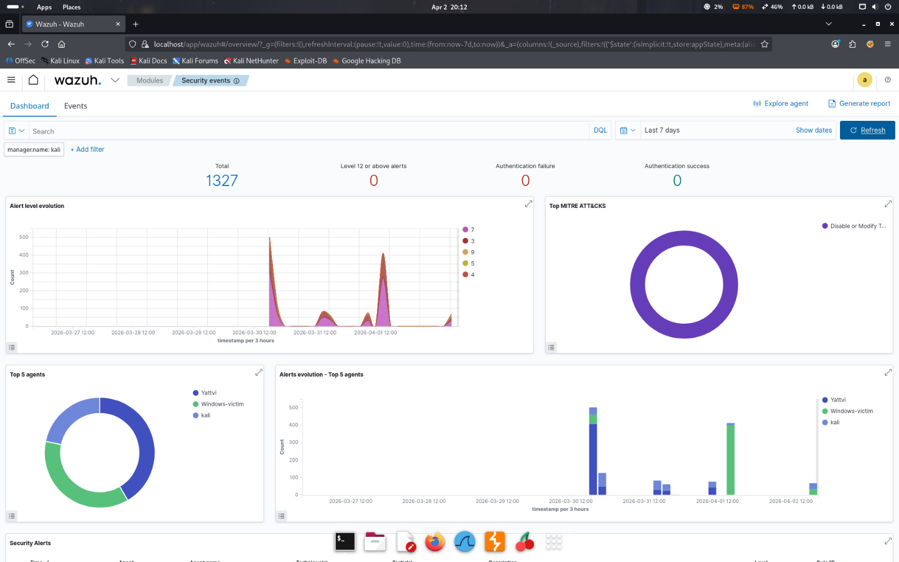
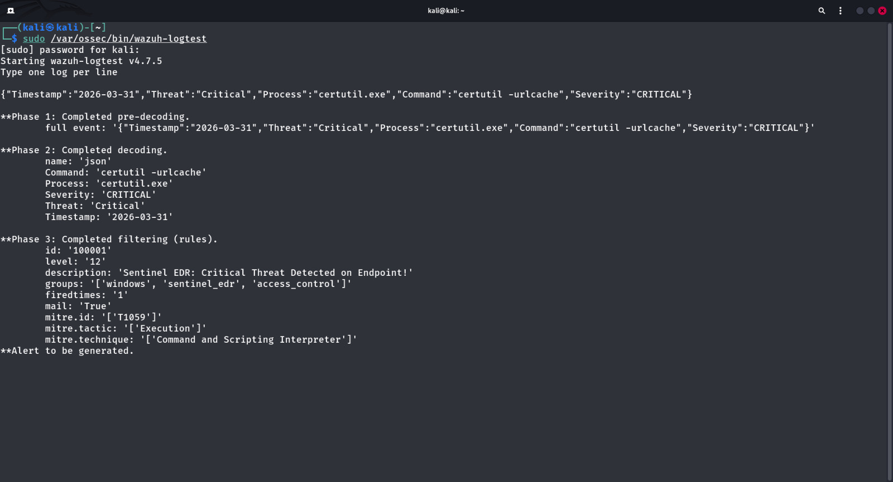

# Sentinel EDR - Custom SIEM Integration

### 🛡️ Project Overview
Sentinel EDR is a lightweight threat detection engine designed to monitor Windows endpoints for suspicious process behaviors. It captures telemetry for Living-off-the-Land (LotL) binaries and forwards structured JSON logs to a **Wazuh SIEM Manager**.

### ✅ Success Proof (Log Validation)
The core logic has been validated using `wazuh-logtest`, successfully triggering **Level 12 Critical Alerts** with MITRE ATT&CK mapping (T1059).

### 📊 Deployment Proof

### ✅ Logic Validation

### 🚀 Key Features
- **Behavioral Monitoring:** Real-time detection of `lsass`, `certutil`, and `vssadmin` misuse.
- **Wazuh Integration:** Custom decoders and high-severity rules (Level 12).
- **MITRE Mapping:** Automatically aligns detected threats with MITRE Tactic: Execution.
- **Full Visibility:** Configured to ingest Windows Security, System, and Application event channels.

### 📁 Repository Structure
- `/src`: Core PowerShell EDR monitoring engine.
- `/config`: Custom Wazuh manager rules and agent configuration snippets.
- `/docs`: Validation logs and terminal screenshots.

### 👨‍💻 Developed By
**YATENDRA DIXIT**
